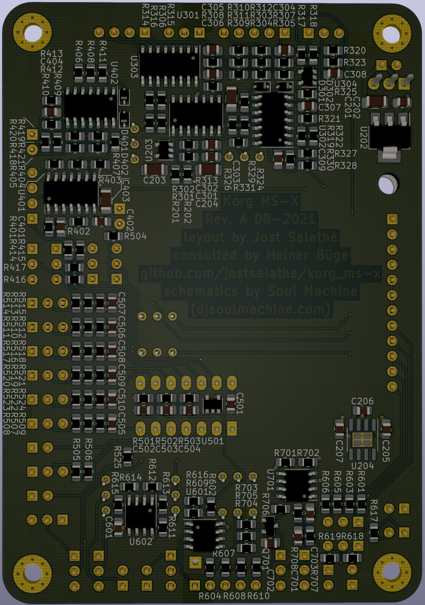

# Korg MS-X

An extreme MONOTRON mod by Soul Machine in form of an SMD PCB.

## Roots

The schematics design and build instructions were published by Soul Machine on his project page
[Far Beyond Perception Instruments](https://www.djsoulmachine.com/farbeyondperception/msx.html)
and as 
[PDF here](http://www.djsoulmachine.com/farbeyondperception/msx/MSX-schematics.pdf).

He built it with a lot of perf board and freehand wiring.

## Where this project takes over

This project aims to take that design and develop a neat printed circuit board with SMD components where sensible so that it can be produced and to a large degree even be assembled by cheap manufacturers like [JLCPCB](jlcpcb.com) or [PCBWay](pcbway.com).

## Parts

0805 chip resistors with 1% tolerance shall be used for relatively easy hand soldering.
Most capacitors are cermaic 0805. 100uF (10V) and 47uF (6V3) use 1206 package instead.

### SMD parts

| Part        | Count | Refs                         | JLCPCB # **extended** (2021-08-27) |
| ---         | ---   | ---                                                 | ---         |
| 100uF       | 3     | C201, C303, C403                                    | **C312983** |
| 10uF        | 10    | C202, C205-C207, C308, C401, C402, C506, C601, C702 | C15850      |
| 47uF        | 2     | C203, C204                                          | C96123      |
| 1uF         | 5     | C301, C302, C304, C305, C701                        | C28323      |
| 100nF       | 7     | C306, C501, C505, C507-C510                         | C49678      |
| 470nF       | 1     | C307                                                | C13967      |
| 22pF        | 1     | C309                                                | C1804       |
| 500pF       | 1     | C404                                                | **C1747**   |
| 47nF        | 1     | C502                                                | C53134      |
| 4.7nF       | 1     | C503                                                | C1744       |
| 470pF       | 1     | C504                                                | C1743       |
| 100pF       | 1     | C703                                                | C1790       |
| 1N4148      | 4     | D301, D302, D401, D402                              | C2128       |
| 2SC945      | 1     | Q701                                                | **C181154** |
| 10k         | 22    | R201, R202, R417, R501, R505-R507, R509, R510, R512, R513, R515, R516, R518, R519, R521, R522, R524, R604, R607, R608, R610 | C17414 |
| 100k        | 43    | R301-R305, R307, R309-R312, R318, R324-R331, R401, R402, R404, R406-R413, R420, R421, R502, R602, R609, R612-R614, R616, R701-R703, R706 | **C149504** |
| 33k         | 1     | R306                                                | C17633      |
| 50          | 1     | R308                                                | **C131893** |
| 5k6         | 2     | R313, R321                                          | C4382       |
| 4k7         | 1     | R314                                                | C17673      |
| 1M          | 4     | R315, R322, R403, R503                              | C17514      |
| 47k         | 2     | R316, R618                                          | C17713      |
| 56k         | 1     | R317                                                | C17756      |
| 12          | 1     | R319                                                | **C204200** |
| 39k         | 2     | R320, R419                                          | C25826      |
| 220k        | 1     | R323                                                | C17556      |
| 22k         | 1     | R405                                                | C17560      |
| 2k2         | 3     | R414-R416                                           | C17520      |
| 180         | 2     | R418, R504                                          | C25270      |
| 1k          | 11    | R508, R511, R514, R517, R520, R523, R525, R601, R605, R619, R707 | C17513 |
| 56          | 1     | R603                                                | C17757      |
| 390         | 1     | R606                                                | C17655      |
| 27k         | 1     | R611                                                | C17593      |
| 330k        | 1     | R615                                                | C17629      |
| 68k         | 1     | R617                                                | C17801      |
| 680k        | 1     | R704                                                | C17797      |
| 470k        | 1     | R705                                                | C17709      |
| 150k        | 1     | R708                                                | C17470      |
| AMS1117-5.0 | 1     | U202                                                | C6187       |
| LMV321      | 3     | U203, U304, U501                                    | C7972       |
| ICL7660S    | 1     | U204                                                | **C7535**   |
| LM324       | 4     | U301, U302, U401, U402                              | C71035      |
| CD4040BM/TR | 1     | U303                                                | **C725347** |
| TL082       | 3     | U601, U602, U701                                    | **C9385**   |

### THT parts

| Part             | Count | Refs                               |
| ---              | ---   | ---                                |
| 10k trimmer pot  | 5     | RV303, RV401, RV601, RV603, RV605  |
| 100k trimmer pot | 3     | RV502, RV504, RV606                |
| DIP-14 IC socket | 1     | U502                               |

### external parts

| Part               | Count | Refs (optional)                  |
| ---                | ---   | ---                              |
| Korg MONOTRON      | 1     | J101                             |
| LED                | 2     | D403, D501                       |
| DC jack            | 1     | J201                             |
| rotary switch 3P4T | 2     | J301, J601                       |
| rotary switch 4P3T | 1     | J401                             |
| 1/4" mono jack     | 3     | J602, J603, J701                 |
| 10k pot            | 9..11 | RV301, RV501, RV503, (RV505), (RV506), RV507, RV508, RV509, RV510, RV602, RV701 |
| 100k pot           | 1     | RV302                            |
| 20k pot            | 2     | RV402, RV403                     |
| 220k pot           | 1     | RV604                            |
| toggle switch SPST | 1..4  | (SW501), (SW502), SW601, (SW603) |
| mom. switch SPST   | 1     | SW605                            |
| toggle switch SP3T | 0..1  | (SW503)                          |
| toggle switch SPDT | 3..4  | (SW504), SW602, SW604, SW701     |
| mom. switch SPDT   | 0..1  | (SW505)                          |

## Pictures

PCB front:

PCB back:

